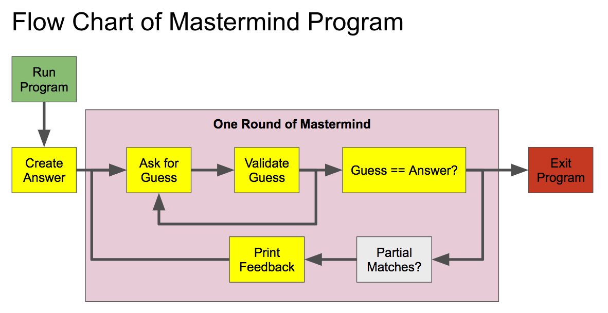

```{r setup, include=FALSE}
knitr::opts_chunk$set(echo = TRUE)
```

<script src='./hideoutput.js'></script>
## About R

```{r, out.width="100px", out.height="100px", echo=FALSE}
knitr::include_graphics("./img/Rlogo.png")
```

As decribed by [The R Foundation](https://www.r-project.org/about.html), 
"R is a language and environment for statistical computing and graphics." 
Importantly, R is open-source, free software distributed under a GNU GPL-3 license. 

It is also easily extensible through contributed packages that cover much of modern
statistics and data science.

### RStudio

[RStudio](https://www.rstudio.com/) is an "integrated development environment" for working with R that 
simplifies many tasks and makes for more efficient user interaction with R. It provides a nice
interface via [Rmarkdown](http://rmarkdown.rstudio.com/) for integrating R code with text for creating documents. 

RStudio is distributed by a company of the same name that also offers a number of related
products for working with data: Shiny for interactive graphics along with 
enterprise and server editions. I suggest you use RStudio when feasible
to streamline your workflow. 

[RStudio IDE cheatsheet](https://github.com/rstudio/cheatsheets/raw/master/rstudio-ide.pdf)

## The masteRmind project {.tabset}

### Overview

As an introduction to programming in R, we will build a version of the game
[mastermind](http://www.webgamesonline.com/mastermind/). In doing so, we will
learn about the following programming concepts:
  - types and classes
  - indexing
  - functions
  - Boolean relational operators
  - `for` and `while` loops
  - simple string manipulations

Many of you have
already created a version of this game in Python.  Think of today as concept
review and an introduction to R syntax.



### Task 1

1. Create and save an R script called `masteRmind.R`
2. Use comments `#` to create a header with a short description of the p
project goal, your name, and today's date.
3. In your script, create an object `std_dict` to represent the following eight colors:
   Red, Green, Blue, Yellow, Gold, Orange, Black, and White.
4. Does your object have names? Set the names attribute of `std_dict` using
the following abbrevations for the colors above: R, Gr, Bu, Y, Go, O, Ba, W.
5. What is the class of your object and how would you check it? What is its length?

[Solution](./masteRmind_task1.R)

### Task 2

6. Write a function `gen_code(n, dict)` that generates a secret code
of length `n` from a dictionary of colors `dict`. Test your function using
`n = 4` and `std_dict`. *Hint: use `sample()`.*

7. Write a function `request_input()` with no paramters that prints a string prompting
   the player for input, waits to recieve that input, and then returns
   the input recieved.
   
*Hint: Get started by defining an empty function `request_input()`. Then,
add a promt using `cat()`. Use `readlines()` to wait for and receive user input.*

8. Modify your `request_input()` function to use an argument `num_guess` that
ask the user for their $n^{th}$ guess. *Hint: Use `sprintf()`*. 

9. Set the default for `num_guess` to 1 in `request_input()`.

10. Copy the following function into your code set to transform user input of the 
form `color, color, color, color` into a vector:

```
# If stringr is available:
split_guess = function(guess, sep = ', '){
 stringr::str_split_fixed(guess, pattern = sep)
}

```

```
# If stringr is not available:
split_guess = function(guess, sep = ', '){
 strsplit(guess, split = sep, fixed = TRUE)[[1]]
}

```

[Solution](./masteRmind_task2.R)

### Task 3

*In this task you will use your knowledge of relational operators and 
conditions while building a function to validate player input.*

11. Write a function `check_code` with arguments `guess`, `secret`, and
defaults `n = 4` and `sep = ', '` that provides user feedback as a list
with slots `n_exact` giving the number of exact mathches and `n_colors` giving
the number of matched colors. *Hint: for correct colors see `help( intersect() )`*.

12. Write a function `feedback` that accept the output from `check_code` and 
prints an instructive message.

13. Write a body for the function `clean_input` that:
  - Validates that the length of the guess is `n` and flags if the guess 
     is too short or too long
  - Validates that the values of the guess are all in the dictionary.
  
```{r}
clean_input = function(guess, n = 4, sep = ', ', dict = std_dict) {

   # split the guess
   guess = split_guess(guess, spe)
   # Check if the guess is too short and set `too_few`
  
   # Check if the guess is too long and set `too_many`
    
   # Check that all of the values of guess are in std_dict
   
   # This is the return value
    list( guess = guess, 
          too_few = too_few, 
          too_many = too_many,
          not_in_dict = not_in_dict,
          error_free = ! any(too_few, too_many, not_in_dict)
  )
}
```

### Task 4

*In this task you will use a for loop to replace any standard abbreviations
in a player's guess with the corresponding color. You will then use a while
loop to put the game together.*

14. Modify your `clean_input` function from the previous task to replace
any abbreviations in the users guess (i.e. names of std_dicts) with their values.
*Hint: Use a `for` loop iterating over the indices of the guess after splitting.*

### Task 5

15. Write a function `play_mastermind` that starts a new game of mastermind when called. Use a 
`while` loop to request user input for succesive rounds until `max_turns = 10` is reached.

*Hints: Refer to the program flow chart under Overview.*

### Task 6
*These are not essential, but are good practice if we have time remaining.*

16. Write a function `print_err` that provides useful feedback when an 
error is encountered. 

17. Modify your `play_mastermind` function to store all values the user has
guessed so far. Modify `feedback` with a `for` loop to print the game history
after each guess.

18. Write a function `start_msg` to print a welcome message and
some basic gameplay instructions when the game starts. Call it from
within your `play_mastermind` function.

19. At the start of your while loop in `play_mastermind`, 
check if the guess is 'q' and quit if so. Add a note about this as part of
feedback after invalid input.

### Challenge

If you want to challenge yourself, write a function to play mastermind. This
function should interact with the existing function -- leaving you to do more
useful things!

## Topics {.tabset}
### R Basics {.tabset}

#### Getting Started
##### Objectves
  + Understand:
      + How objects are created, used, and inspected.
      + Basic types in R
      + Standard properties of vectors
  + Be able to:
      + View and clear the global environment.
      + Create named and unnamed vectors.
      

##### Objects
Everything in `R` is an object that can be referred to by name. We create
objects by assigning values to them:

```{r,1}
# This is a comment ignored by R
Instructor <- 'James'

# Two ways to assign values to objects
x <- 10
y = 32
z <- c(x, y) #Form vectors by combining or concatenting elements.

9 -> w # This works, but is bad style.
TheAnswer = 42 # Most other languages use = for assignemnt.
```

The values can be referred to by the object name:

```{r,2}
TheAnswer
```

Objects can be any syntacticaly [valid](https://stat.ethz.ch/R-manual/R-devel/library/base/html/make.names.html)
name. You should, however, avoid clobbering built in `R` names such as `pi`, `mean` or `sum`.
You also should not use [reserved words](https://stat.ethz.ch/R-manual/R-devel/library/base/html/Reserved.html) when naming objects.

Finally, it is important to remember that in `R` objects are stored by value and __not__ by reference:
```{r,3}
z <- c(x, y)
c(x, y, z)
y = 42
c(x, y, z)
```

In contrast, if `z <- c(x,y)` were a reference to the contents of `x` and `y` then
changing `y` would change `z` and the value refered to by `z` as well.

##### Classes, Types and Vectors

We say earlier that we can create a vector using the concatenate function `c`. 

In getting started with R, you need to know the following basic types:

 - logical 
 - integer
 - numeric (or *double*) `3 / 2 = 1.5`
 - character
 

```{r}
# Numeric class using double precision
class( c(1, 2, 3) )

# Integer class
class( c(1L, 2L, 3L) )

# Character class

class( c( '1', '2', '3') )
class( c( "1", "2", "3") )
```

Vectors must have elements all of the same type. Rather than throwing an
error or warning, `R` will promote values to the highest class if it is able.

```{r}
char = c( '1', '2', '3' )
int = c( 1L, 2L, 3L )
num = c( 1, 2, 3 )

# Type promotion
class( c(int, num) )
class( c(int, num, char) )
```

##### Names and length
Elements of vectors can be given names. Access or modify an object's names attribute
using the `names()` function. Clear an object's names using `unnname()`. 

```{r,12}
z = c( 'x' = 10, 'y' = 42)
zz = c( xx = 10, yy = 42)
names(z)
names(zz)
names(z) <- c('Xval','Yval'); names(z)
unname(z)
```

The `length()` function returns the number of elements in a vector:

```{r}
length(int); length(num); length(char)
length( c(int, num, char) )
```

##### Vector indexing

Specific elements within a vector can be set or extracted using brackets `[]`. 

```{r}
LETTERS[ 8 ]
initials = LETTERS[ c(10, 8) ]
initials = c(initials[1], LETTERS[2], initials[2])

```

Vectors with names can also be indexed by name using character vectors.

```{r}
months = month.name
names(months) = month.abb
months[c('Aug', 'Sep')]
```

##### Arithmetic
`R` can do arithmetic with objects that contain numeric types.
```{r,4}
x + y
z / x
z^2
z + 2*c(y,x) - 10  

11 %% 2   # Modular arithmetic (i.e. what is the remainder)
11 %/% 2  # Integer division discards the remainder 
```

Be careful about mixing vectors of different lengths as `R` will generally
recycle values:

```{r,5}
x = 4:6
y = c(0, 1)
x*y
```


```{r,6}
x = 1:4
y = c(0, 1)
y*x
```

There are a number of common mathematical functions already in `R`:
```{r,7}
mean(x) # average
sum(x)  # summation
sd(x)   # Standard deviation
var(x)  # Variance
exp(x)  # Exponential
sqrt(x) # Square root
log(x)  # Natural log
sin(x)  # Trigonometric functions
cos(pi/2) # R even contains pi, but only does finite arithmetic
```

##### Global Environment
The values are stored in a workspace called the global environment. You can
view objects in the global environment using the function 'ls()' and remove objects
using 'rm()':

```{r,8}
ls()
rm(w)
ls()
```

We can remove multiple objects in a few ways:
```{r,9}
remove(Instructor, TheAnswer) # remove and rm are synonyms
ls()
rm(list=c('x', 'y')) # Object names are passed to list as strings
ls()
```

To clear the entire workspace use 'rm(list=ls())':
```{r,10}
ls()
rm(list=ls())
ls()
```

##### More on objects
Functions are also objects:
```{r,11}
ViewGlobalEnv <- ls
ViewGlobalEnv()
```

##### Exiting and help
Use `quit()` or `q()` to quit `R`. Use `help()` or `?function` to get help.

#### Functions

##### Objectves
  + Understand:
      + How `R` knows to interpret something as a function. 
      + How arguments passed to functions are interpreted.
      
  + Be able to:
      + Write and call a function.
      + Write unit tests for functions

##### Functions
As we saw in "Getting Started", `R` 
identifies functions by the 'func()' construction. Functions 
are simply collections of commands that do something.  Functions take *arguments* 
which can be used to specify *which* objects to operate on and *what* values of parameters
are used. You can use 'help(func)' to see what a function is used for and what arguments it expects, i.e. `help(sprintf)`.

```{r}
x = cat('The function `cat` parses strings and prints them out.\n')

# The cat function returns NULL.
x
```

The `sprintf()` function is useful for adding object values at specific places
within strings. Its first argument is a string with `%` followed by a format
indicating a location to substitute a value. 

```{r}
max_guesses = 10
sprintf('You get %i guess to break my code!\n', 10)

cat(sprintf('You get %i guess to break my code!\n', 10))
```

Another useful function for working with strings is `paste()`.

```{r}
paste( c("Let's", "play", "mastermind!"), collapse=" ")
```

##### Arguments

Functions will often have multiple arguments.  Some arguments have default values, others do not.
All arguments without default values must be passed to a function. 
Arguments can be passed by name or position. For instance, consider the
`sample` function for randomly sampling a vectors contents.

```{r, 14}
# Mandatory arguments are "x" and "size"
sample( x = letters, size = 5)

# You can plass these arguments by position
sample( letters, 5)

# Convention is to leave only first argument unnamed
sample( LETTERS, size = 5)

```

Arguments passed by name need not be in order:

```{r,15}
# This works, but is bad style.
sample( size = 4, x = letters)
```

##### Writing Functions
You can create your own functions in `R`. Use functions for tasks that you repeat
often in order to make your scripts more easily readable and modifiable. A good rule
of thumb is never to copy an paste more than twice; use a function instead.  It can
also be a good practice to use functions to break complex processes into parts, especially
if these parts are used with control flow statements such as loops or conditionals.

Here is the basic syntax for defining a function

```
function_name = function(param1, param2 = default) {
 # Define body of function here
}
```

```{r,16-z-score1}
# function to compute z-scores
zScore1 = function(x){
  xbar = mean(x)
  s = sd(x)
  z = (x - mean(x)) / s
  return(z)  
}
```

The return statement is not strictly necessary, but can make complex functions more
readable. It is good practice to avoid creating intermediate objects to store values only used once.  
```{r,17-z-score2}
# function to compute z-scores
zScore2 = function(x){
  {x - mean(x)} / sd(x)
}
```

```{r,18}
x = rnorm(10, 3, 1) ## generate some normally distributed values
round( cbind(x, 'Z1' = zScore1(x), 'Z2' = zScore2(x)), 1)
```

##### Default parameters
We can set default values for parameters using the construction 'parameter = xx' in the 
function definition.

```{r,19-z-score3}
# function to compute z-scores
zScore3 = function(x, na.rm=T){
  {x - mean(x, na.rm=na.rm)} / sd(x, na.rm=na.rm)
}
```

```{r,20}
x = c(NA, x, NA)
round(cbind(x, 'Z1' = zScore1(x), 'Z2' = zScore2(x), 'Z3' = zScore3(x) ), 1)
```

##### Scope

Scoping refers to how R looks up the value associated with an object referred to 
by name.  Objects defined with the braces `{} ` of a function body, are defined
only in the scope of that function. 
```{r}
# Global values
a = 'a'
x = 0

# x and a are defined locally in this funciton
f1 = function(a){
  x = 1
  a = x
  cat(a, '\n')
}


f1(10)
cat(a, '\n')

# Look for x in the enclosing enviroment
f2 = function(a){
  a = x
  cat(a, '\n')
}
f2(10)
```

##### Unit tests
When defining your own functions, it is helpful to write small tests with
inputs form known results. Here's an example using the z-score function:

```{r}
zScore3( c(-1, 0, 1))

# A more formal version of the above using concepts to come
zScore3_test = function(){
  all( zScore3( c(-1, 0, 1)) == c(-1, 0, 1) )
}
zScore3_test()
```


#### Lists 
In `R` a list is a generic container for storing values of multiple types. 

```{r}
myList = list(Name='An example list',
               Matrix=diag(5),
               n=5
               )
myList
class(myList)
length(myList)
names(myList)
```

You can access a specific element in a list by position or name:
```{r}
myList[['Name']]
myList$Matrix
```

Note the use of double brackets ('[['n']]) and compare to the single bracket case below.

```{r}
class(myList['n'])
class(myList[['n']])
```


#### Logicals and Boolean Comparisons

##### Logicals

`R` has three reserved words of type 'logical':

```{r}
typeof(TRUE)
typeof(FALSE)
typeof(NA)
if(TRUE && T){
  print('Synonyms')
}
if(FALSE || F){
  print('Synonyms')
}
```

While 'T' and 'F' are equivalent to 'TRUE' and 'FALSE' it is best to always 
use the full words. You should also avoid using 'T' or 'F' as names for objects or
function arguments.

##### Boolean comparisons

Boolean operators are useful for generating values conditionally on other values.
Here are the basics:

 Operator | Meaning 
-----------|-------
`==` | equal
`!=` | not equal
`>`, `>=` | greater than (or equal to)
`<`, `<=` | less than (or equal to)
 `&&` | scalar AND
 `||` | scalar OR
 `&` | vectorized AND
 `|` | vectorized OR
 `!`  | negation (`!TRUE == FALSE` and `!FALSE == TRUE`)
 `any()` | are ANY of the elements true
 `all()` | are ALL of the elements true
 
Logicals are created by Boolean comparisons:

```{r}
{2*3} == 6     # test equality with ==
{2+2} != 5     # use != for 'not equal'
sqrt(69) > 8   # comparison operators: >, >=, <, <=
sqrt(64) >= 8  
!{2==3}        # Use not to negate or 'flip' a logical
```

Comparison operators are vectorized:
```{r}
1:10 > 5
```

You can can combine operators using 'and (&)' or 'or (|)':
```{r}
{2+2}==4 | {2+2}==5 # An or statement asks if either statement is true
{2+2}==4 & {2+2}==5 # And requires both to be true
```

Note the difference between the single version, which is a vectorized
function, and the double version which operates bitwise:

```{r}
even = {1:10 %% 2} == 0
div4 = {1:10 %% 4} == 0

even | div4
even || div4

even & div4
even && div4
```

Use `any` or `all` to efficiently check for the presence of any `TRUE` or `FALSE`.
```{r}
any(even)
all(even)
```

##### %in%

Another very useful operator is the special function `%in%`, which tests each element
of a vector for membership in the *set* represented by another.

```{r}
squares = {1:10}^2
evens = seq(2, 100, 2)

x = squares %in% evens
names(x) = squares
x
```


##### Using which
The 'which()' function returns the elements of a logical vector that are true:
```{r}
which({1:5}^2 > 10)
```

A combination of which and logicals can be used to subset vectors

```{r}
x = 1:100
x[ which( x %in% {1:10}^2 ) ]
```

#### Conditionals
In programming, we often need to execute a piece of code only if some condition is
true.  Here are some of the `R` tools for doing this.

##### if statements
The workhorse for conditional execution in `R` is the `if` statement.  In the syntax below, note
the spacing around the condtion enclosed in the parantheses.  

```{r}
if (TRUE) {
  print('do something if true')
}
```

There are different opions on whether to use the above or this:
```{r}
if(TRUE){
  print('do something if true')
}
```

You can choose a style of your choosing, but be _consistent_. Occasionally,
with short statements it can be idomatic to include the condition on the same line
without the braces:

```{r}
if(TRUE) print('do something if true')
```

Use an `else` to control the flow without separately checking the conditon's negation:
```{r}
if ({2+2}==5) {
  print('the statement is true')
} else {
  print('the statement is false')
}
```

There is also a vectorized `ifelse` function that can be useful for comparing
multiple condtions along a vector. 

```{r}
result = c(4,5)
report = ifelse(result==4, 'true', 'false')
report
```

For more complex cases, you may want to check multiple condtions:

```{r}
a = -1
b = 1
if (a*b > 0) {
  print('Zero is not between a and b')
} else if (a < b) {
    smaller = a
    larger = b
} else {
    smaller = b
    larger  = a
}
smaller
larger
```

In all of the examples above, please pay close attention to the use 
of indentation for clarity. 

#### Control Statments {.tabset}

##### `for` loops
Here is the syntax for a basic `for` loop in `R`

```{r}
for ( i in 1:10 ) {
   cat(i,'\n')
}
```

Note that the loop and the *iterator* are evaluated within the global environment.

```{r}
i
```

##### while 
A while statement can be useful when you aren't sure how many iterations will be needed.  
Here is an example that takes a random walk and terminates if the value is
more than 10 units from 0.

```{r}
maxIter = 1e3 # always limit the total iterations allowed
val = vector(mode='numeric', length=maxIter)
val[1] = rnorm(1) ## intialize
k = 1
while ( abs(val[k]) < 10 & k <= maxIter ) {
  val[k+1] = val[k] + rnorm(1)
  k = k + 1
}
val = val[1:{k-1}]
plot(val, type='l')
```

##### key words
The following key words are useful within loops:
  
  + `break` - break out of the currently excuting loop
  + `next` - move to the next iteration immediately, without executing 
  the rest of this iteration (`continue` in other languages such as C++)

Here is an example using `next`:
```{r}
for (i in 1:10) {
  if (i %% 2 == 0) next
  cat(i,'\n')
}
```

Here is an example using `break`:

```{r}
x = c()
for (i in 1:1e1) {
  if (i %% 3 == 0) break
  x = c(x,i)
}
print(x)
```


### Packages 

#### Objectives:
  + Understand:
    + Basics of the `R` package system
    + What it means for a function to be 'masked'
  + Be able to:
    + Install packages
    + Make a package available to R
    + Call functions from packages without loading
    + Remove packages

#### The `R` package system

Much of the utility of `R` is derived from an extensive collection of user
and domain-expert contributed packages. Packages are simply a standardized way
for people to share *documented* code and data. There are thousands of packages!

Packages are primarily distributed through three sources:

  + [CRAN](https://cran.r-project.org/) 
  + [Github](http://r-pkgs.had.co.nz/git.html)
  + [Bioconductor](https://www.bioconductor.org/)

##### Installing packages
The primary way to install a package is using 'install.packages("pkg")'.
```{r,21}
#install.packages('lme4') # the package name should be passed as a character string
```

You can find the default location for your `R` packages using the `.libPaths()`
function. If you don't have write permission to this folder, you can set this directory
to a personal library instead.
```{r,22}
.libPaths() ## The default library location
.libPaths('/Users/jbhender/Rlib') #Create the directory first!
.libPaths()
```
To install a package to a personal library use the 'lib' option.
```{r,23}
## install.packages("haven",lib='/Users/jbhender/Rlib')
```

If your computer has the necessary tools, packages can also be installed from source by downloading the package file and pointing directly to the source tar ball ('.tgz') or Windows binary.  

#### Using packages in `R`
Installing a package does not make it available to `R`! There are two ways to
use things from a package: 

  + calling `library("pkg")` to add it to the search path
  + using the `pkg::function` construction.

These methods are illustrated below using the data set 'InstEval' distributed
with the 'lme4' package.

```{r,24}
#head(InstEval)
## Using the pkg::function construction
head(lme4::InstEval)
```

The `library("pkg")` command adds a package to the search path.
```{r,25}
search()
library(lme4)
search()
head(InstEval)
```

To remove a library from the search path use `detach("package:pkg", unload=TRUE)`.
```{r,26}
detach(package:lme4, unload=TRUE)
search()
```

